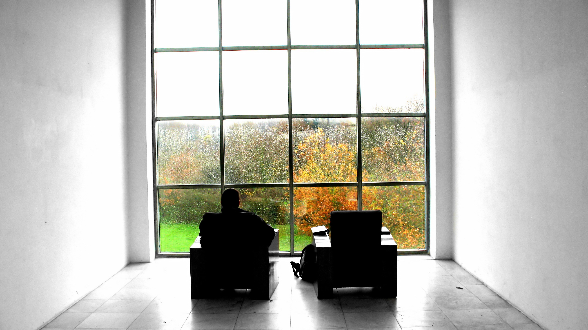

# infinite-recursive-image
A script to create the [Droste effect](https://en.wikipedia.org/wiki/Droste_effect) with any image. Supports both rectangular and skewed boxes.

## Usage

Run:

```
$ git clone github.com/EkanshdeepGupta/infinite-recursive-image
$ cd ./infinite-recursive-image
$ python ./nested_photo.py -h
    usage: nested_photo.py [-h] [-o | -s] [-n COUNT] filename dimensions

    positional arguments:
      filename              the filename of the image to be processed.
      dimensions            the pixel dimensions of the box to create the effect. With -n, the
                            dimensions have to be given as "x1,y1,x2,y2" With the -s flag, dimensions
                            have to be given as "(x1,y1),(x2,y2),(x3,y3),(x4,y4)"

    optional arguments:
      -h, --help            show this help message and exit
      -o, --orthogonal      flag used to run the script on an orthogonally rectangular box. Defaults
                            to orthogonal mode.
      -s, --skew            flag used to run the script on a non orthogonally rectangular box.
      -n COUNT, --count COUNT
                            number of times to recurse. Defaults to 10.
```

For orthogonal mode, the dimensions can be given as a comma separated string of four numbers, which denote the pixel coordinates of the left, top, right, bottom edge respectively, of the box on which to generate the Droste effect. Since orthogonal mode only works on orthogonal rectangles, only the edges can be specified. For non-rectangular boxes, use skew mode with the `-s` flag.

For skew mode, the dimensions can be given as a string of four 2-tuples of numbers, which denote the pixel coordinates of the left, top, right, bottom corner respectively, of the box on which to generate the Droste effect.

The pixel coordinates for dimensions can be found using any photo-editing software like GIMP or Adobe Photoshop.

## Examples

Get the outputs stored in `./examples` as follows:


```bash
$ python nested_photo.py ./examples/modern-tv-cabinet.jpg "552,238,1049,540"
```


```bash
$ python nested_photo.py ./examples/gray-wooden-sideboard.jpg "721,217,1217,550"
```


```bash
$ python nested_photo.py ./examples/black-white.jpg -s "(246,312),(889,456),(887,826),(250,839)"
```


```bash
$ python nested_photo.py ./examples/living-room.jpg -s "(450,1020),(1196,1036),(1197,1430),(449,1476)"
```




```bash
$ python nested_photo.py "./examples/seats.jpg" -s "(1231,281),(2357,265),(2367,1009), (1244,1025)"
```


#### Photo Credits

* Modern TV Cabinet - Photo by MAX 3D Design from Shutterstock.
* Gray Wooden Sideboard - Photo from Pexels.
* Black White - Photo by [Sidekix Media](https://unsplash.com/@sidekix?utm_source=unsplash&utm_medium=referral&utm_content=creditCopyText) on [Unsplash](https://unsplash.com/s/photos/living-room?utm_source=unsplash&utm_medium=referral&utm_content=creditCopyText).
* Living Room - Photo by Jean van der Meulen from Pexels.
* Seats - Photo by <a href="https://freeimages.com/photographer/mrmaris-50513">Simon Maris</a> from <a href="https://freeimages.com">FreeImages</a>.


### To-do

- [x] Create a skew version to handle non-square boxes.
